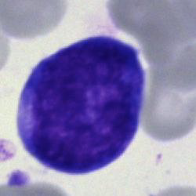
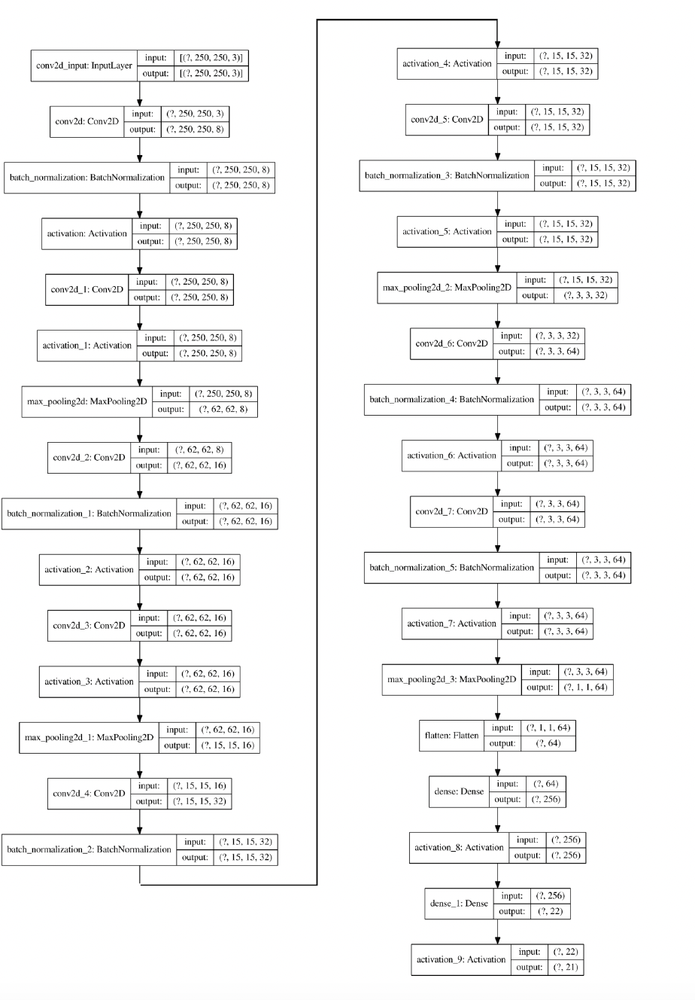
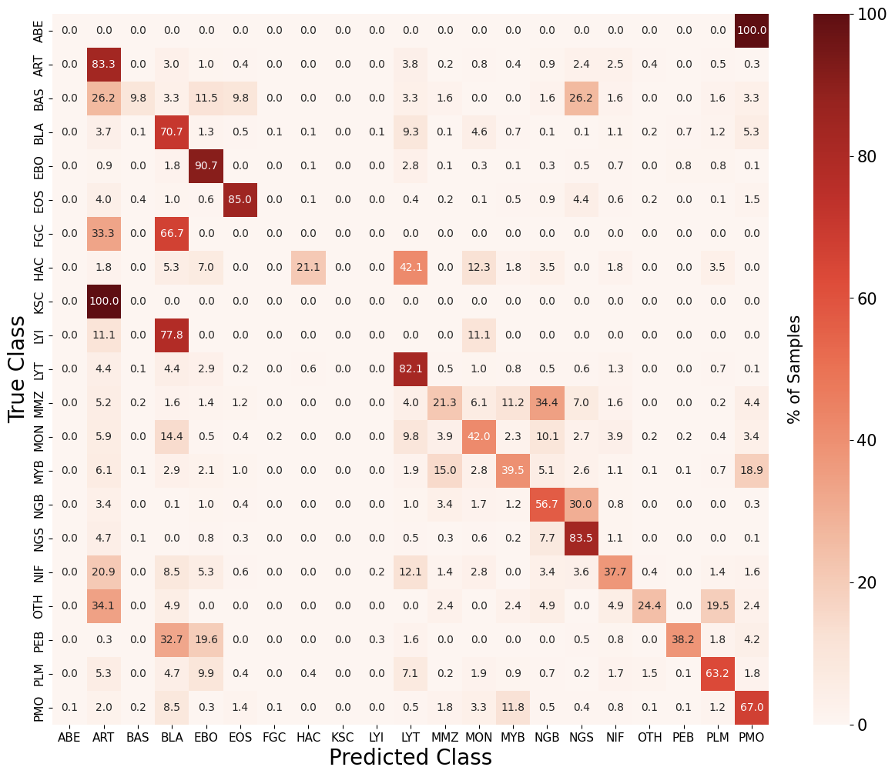
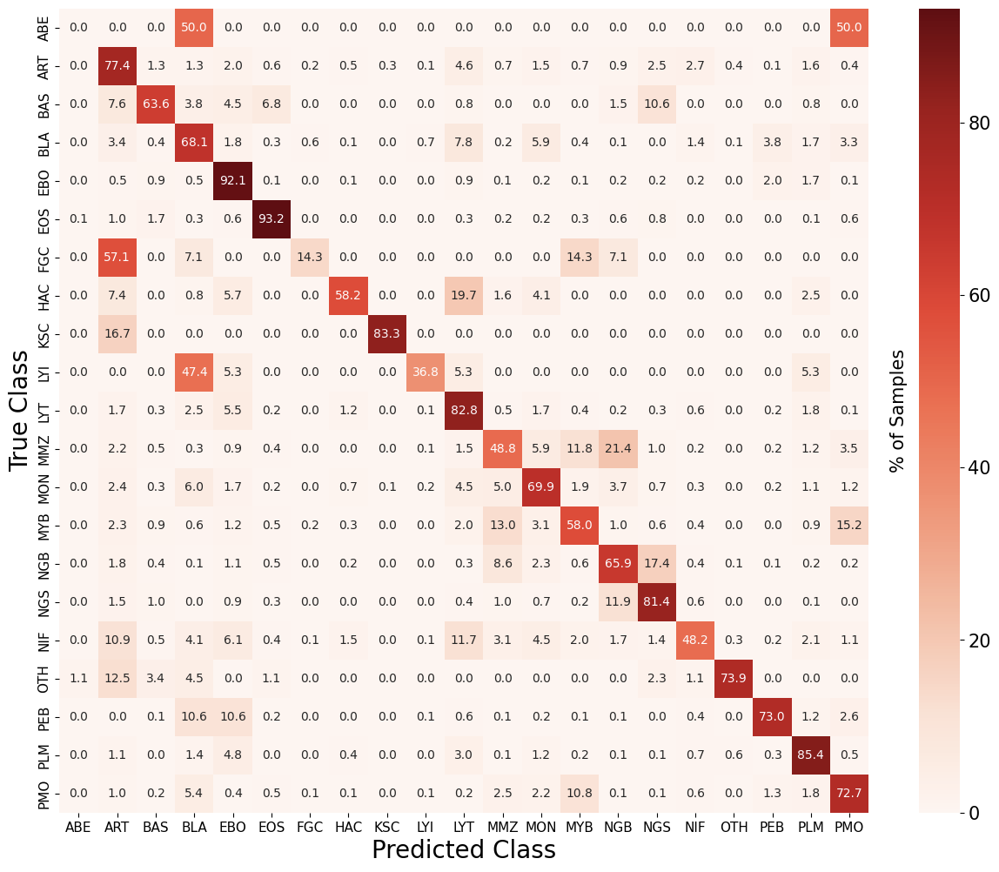
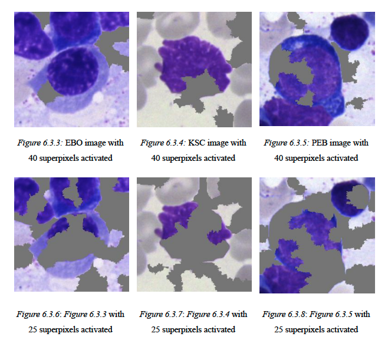
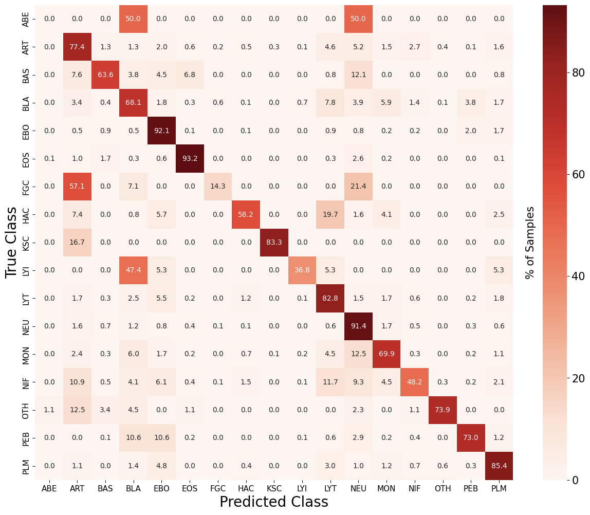

## Deep Learning for Cancer Detection

<p align="center">
    
</p>

<p align="center">
    <a href="#Abstract">Abstract</a> •
    <a href="#Dataset">Dataset</a> •
    <a href="#Model-Selection">Model Selection</a> •
    <a href="#Explainable-AI">Explainable AI</a> •
    <a href="#Recommendations">Recommendations</a> •
    <a href="#Running-Instructions">Running Instructions</a>
</p>

## Abstract

Blood cancer affects approximately 1 in 16 men and 1 in 22 women during their lifetime (Blood Cancer
UK). This study explores deep learning to assist hematologists in classifying bone marrow cells for
diagnosing various blood cancers. Using images from the Bone Marrow Cytology in Hematological
Malignancy dataset containing over 170,000 samples and 21 classes, a convolutional neural network
(CNN) was trained. Through iterative refinement via hyperparameter tuning and data augmentation,
results revealed the best model employed data augmentation to obtain a validation accuracy of 78.2%,
outperforming the baseline model’s accuracy of 74.0% and the hyperparameter-tuned model’s accuracy of
76.0%. Generalisation to unseen data was demonstrated with a test accuracy of 78.3% for the
data-augmentation model whilst the baseline and hyperparameter-tuned models obtained a test accuracy
of 74.5% and 75.9% respectively. However, concerns regarding the black-box nature of CNNs in medical
diagnosis were raised due to potential false predictions, necessitating interpretability for gaining trust.
Most research regarding medical imaging fails to address this issue, while some attempt to use local
interpretable model-agnostic explanations (LIME) to segment an
image into the most important features, known as superpixels. However, depending on the number of superpixels
chosen to visualise, an imprecise explanation as to why these models produce particular output may be
produced. This study addresses this issue by determining the number of superpixels required for an
explanation of bone marrow smears to justify the optimised model’s prediction. From this, it was
discovered that on average, 43 superpixels are present in any given image and that 40 superpixels are
required for explanations to be sufficient enough to justify the best model’s prediction.

Note: This repository forms the artifacts for a BSc Dissertation at the University of St Andrews. The full report is provided in the repository under [DeepLearningForCancerDetectionReport.pdf](https://github.com/ejml1/Deep-Learning-for-Cancer-Detection/blob/main/DeepLearningForCancerDetectionReport.pdf)

## Dataset

The Bone Marrow Cytology in Hematological Malignancy dataset from the Cancer Image Archive is the
dataset employed in this investigation. 

Images were acquired
using a brightfield microscope with 40x magnification and oil immersion. All samples underwent
processing at the Munich Leukemia Laboratory (MLL) where they were scanned using Fraunhofer
IIS-developed equipment and post-processed using Helmholtz Munich software to produce images with a
ratio of 250x250 pixels. 

This dataset contains 21 classes of over 170,000 de-identified, expert-annotated
single-celled images from 945 patients with a variety of hematological diseases (with Myeloma being the
most prominent). 

Each sample was stained using the May-Grünwald-Giemsa/Pappenheim method. Due to
the rarity of occurrence of certain cell types and abnormalities, the distribution of data between classes is
not even. 

To prevent influencing the labelling of cell images that are easily classifiable
during the training of deep learning models, distinct categories are introduced for artefacts1, unidentified
cells, and other cells that fall into morphological classes not covered by the classification system (Matek
et al., Deep Neural Networks, 1918).


The dataset has not been included as it is 6.8 GB. It can be downloaded using the IBM Aspera Connect plugin from the following link: https://wiki.cancerimagingarchive.net/pages/viewpage.action?pageId=101941770 

## Model Selection

The main minimum viable analysis model is a sequential CNN proposed by Matek et al. Regarding performance metrics, the model scores 74% in precision, recall, and F1-score, but the balanced accuracy is only 44%. It effectively classifies majority classes, notably achieving 90.7% accuracy for the EBO class. However, for minority classes (FGC, HAC, OTH, LYI), which comprise less than 0.3% of the dataset, predictions are rare, as these are often misclassified into majority classes. Other classes with 1.5-6% of images see better performance, but the model's overall generalizability is limited.

<p align="center">
    
    Minimum Viable Analysis model proposed by Matek et al.
</p>

<p align="center">
    
    Normalised confusion matrix showing the distribution of predictions for each class for the
main minimum viable analysis model on the validation set
</p>

Through hyperparameter tuning and data augmentation, the model was able to reach a validation accuracy of 78.2%. Precision, recall, and F-1 score also presented an increase from 74% for all 3 metrics to
80%, 78%, and 79% respectively. Balanced accuracy presented the largest increase from 44% to 61% as
minority classes were being more accurately predicted

This model
also proved to be effective with generalising on unseen data as the model achieved a 78.3% accuracy and
64% balanced accuracy against the test data. Precision was 80%, recall was 78%, and the F1-score was 79% on the test set. The trend
of the test results being extremely similar to the validation results continued as accuracy for the validation
set was 78.2%, with a balance accuracy, precision, recall, and F1-score being identical to the test results.

<p align="center">
    
Normalised confusion matrix for the optimised model using data augmentation on the test
set
</p>

Details of hyperparamter choices and implementation of data augmentation methods can be found in Section 4.6 Hyperparameter Tuning and 4.7 Data Augmentation in the [report](https://github.com/ejml1/Deep-Learning-for-Cancer-Detection/blob/main/DeepLearningForCancerDetectionReport.pdf).

## Explainable AI

Deep learning models such as CNNs are black-box models. This is an
ethical concern regarding medical diagnoses due to the criticality of incorrect outputs. By applying a
technique like LIME, we can understand which features within an image contribute most to a
model’s decision-making process. 

Details of the experiment can be found in Section 6. Explainable AI Experiment in the [report](https://github.com/ejml1/Deep-Learning-for-Cancer-Detection/blob/main/DeepLearningForCancerDetectionReport.pdf).


An explanation is considered sufficient if it contains enough information such that if a different model or the same CNN were to classify just the explanation itself, it would yield the same classification as the original image.

The experiment found that 40 superpixels were required to be sufficient enough to justify the explanation provided by LIME. Given that the average number of superpixels per image is 43, 40 superpixels would indicate nearly all of
the image has to be present.

This may be because all cell classes were stained using the same method, meaning the texturing of the
cells will appear homogeneous under the microscope. When parts of the cell image are occluded, the
morphological features of the cell also become less apparent, causing all images with occlusions to look
extremely similar to each other. This possibly creates confusion within the model's prediction as it
becomes unsure of what it is seeing. 

<p align="center">
    
Comparison of a differing number of superpixels across different classes
</p>


## Recommendations

* Despite being able to see significant gains in accuracy to 78.2% on
completely unseen data, this may be too low for use in clinical applications. This is especially true for
minority classes like HAC where not only does their presence in blood guarantee cancer, their hair-like
structure makes it distinct to categorise compared to most other cells. Having an accuracy of 58.2% for
this class would be unacceptable. 
* However, if we consider that manual examinations can sometimes have
an error rate of 30-40%, this model may still provide some benefit to medical practitioners in reducing the
time needed to classify most cell types.
* Despite the different stages of neutrophil development often being incorrectly predicted with each other,
measuring the accuracy of this larger group of cells is still useful. This is because the
neutrophil-lymphocyte ratio can be used to determine a patient’s outcome in a variety of cancers (Guthrie
et al. 219), allowing practitioners to determine an appropriate course of action. A new class called NEU
using the test set confusion matrices for the best-performing model can be produced
The figure below reveals that despite this model not being able to accurately identify the individual stages of
neutrophil development well, by creating a single neutrophil group that encapsulates all these subclasses,
the model can correctly predict 16,723 images. This represents a 91.4% accuracy for NEU, making it the
third most accurate class behind BLA and EBO. This result proves promising as it leads me to believe the
model was able to identify shared features of these cells well. 
* Through the explainable AI experiment, 40 superpixels were required to reach "significant justification" for the explanations provided by LIME. As most images contained 43 superpixels, this highlights a challenge regarding explaining the output provided by the best model. Other explainable AI techniques, such as Grad-CAM, can be utilised alongside LIME to produce multiple explanations for how a CNN classifies an image. This will increase the confidence when evaluating the reasoning behind the models output.

<p align="center">
    
Normalised confusion matrix for the optimised model using data augmentation on the test
set where the neutrophils (PMO, MYB, MMZ, NGB, and NGS) are grouped into one category NEU
</p>

## Running Instructions

The downloaded dataset should be named “BM_cytomorphology_data” and placed in the submission folder for the following steps. 

The submission contains a Dockerfile to create a container containing all the required dependencies. The following commands can be used to build and run the container. The following code should then be all run on the docker container’s command line:

```bash
docker build -t model .


docker run -v <replace-with-path-to-the-following-directory>/Deep-Learning-for-Cancer-Detection:/Deep-Learning-for-Cancer-Detection -w /Deep-Learning-for-Cancer-Detection --gpus 1 --shm-size=1g -it -p 8888:8888 --rm model

```

In the preprocess directory, run the following command to remove the identified corrupted images from the dataset:

```bash
python DeleteCorrupted.py
```

The dataset can then be split into the train, validation, and test subsets by creating 2 directories for the validation and test subsets and running the following command. For the purpose of training and testing the model for execution, the 2 directories should be named “validation” and “test”: 

```bash
python Split.py
```

This script will then ask for the train (the BM_cytomorphology_data directory), validation, and test directories to be input.

To create reproducible results, data augmentation was not performed on the fly. To augment images, copy or rename the “BM_cytomorphology_data” directory to “BM_cytomorphology_data_augmented” should be created. The following command can then be run (not this will take a long time): 

```bash
python AugmentImages.py
```

To generate explanations to perform the LIME experiment, the following command can be run after creating an explanations/validation directory:

```bash
./CreatePerturbations.sh
```

Before training the optimised model, the following directories should be created. This is used to save the model itself and its training history as a pickle file:

```bash
pickle/augmented
```

The following script can then be run in the docker container’s command line to train the model, note that the expected training directory is “BM_cytomorphology_data_augmented”. Therefore, if the data has not been augmented, it should be renamed to “BM_cytomorphology_data_augmented” anyways.

```bash
python OptimisedModel.py
```

The LIMEResults notebook can be run through JupyterLab in the docker container to produce the LIME experiment results.
